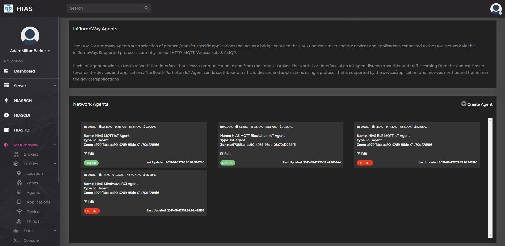

# Installation Guide (Ubuntu)


# Introduction
This guide will take you through the installation process for the **HIAS MQTT IoT Agent**.

&nbsp;

# Prerequisites
You will need to ensure you have the following prerequisites installed and setup.

## HIAS Core

The HIAS MQTT IoT Agent is a component of the [HIAS - Hospital Intelligent Automation Server](https://github.com/leukaemiamedtech/hias-core). Before beginning this tutorial you should complete the [HIAS Core](https://hias-core.readthedocs.io/en/latest/installation/ubuntu/) installation guide ensure your HIAS server is online.

&nbsp;

# Installation
You are now ready to install the HIAS MQTT IoT Agent software.

## Clone the repository

Clone the [HIAS MQTT IoT Agent](https://github.com/leukaemiamedtech/hias-mqtt-iot-agent " HIAS MQTT IoT Agent") repository from the [Peter Moss Leukaemia MedTech Research CIC](https://github.com/leukaemiamedtech "Peter Moss Leukaemia MedTech Research CIC") Github Organization to your HIAS project root.

To clone the repository and install the project, make sure you have Git installed. Now navigate to your HIAS Core project root and then use the following command.

``` bash
 git clone https://github.com/leukaemiamedtech/hias-mqtt-iot-agent.git
 mv hias-mqtt-iot-agent components/agents/mqtt
```

This will clone the HIAS MQTT IoT Agent repository and move the cloned repository to the agents directory in the HIAS Core project (components/agents/mqtt/).

``` bash
 cd components/agents/
 ls
```

Using the ls command in your home directory should show you the following.

``` bash
 mqtt
```

## Installation script

All other software requirements are included in **scripts/install.sh**. You can run this file on your machine from the HIAS project root in terminal. Use the following command from the HIAS Core project root:

``` bash
 sh components/agents/mqtt/scripts/install.sh
```

&nbsp;

# HIAS Setup

This device is a **HIAS IoT Agent** and uses the **HIAS iotJumpWay MQTT Broker** to communicate with the HIAS network. To set up an IoT Agent on the HIAS network, head to your **HIAS Server UI**.

The HIAS network is powered by a context broker that stores contextual data and exposes the data securely to authenticated HIAS applications and devices. Each HIAS IoT Agent has a JSON representation stored in the HIASCDI Context Broker that holds their contextual information.

## HIAS IoT Agent

A HIAS IoT Agent is a bridge between HIAS devices and applications, and the **HIASCDI Context Broker** & **HIAS Historical Data Broker**. The IoT Agents process incoming data using a specific machine to machine communication protocol and then converting into a NGSI v2 compatible format, before sending the data to HIASCDI & HIASHDI.



You will now need to create your HIAS IoT Agent and retrieve the agent credentials. Navigate to **IoT->Entities->Agents** and click on **+ Create Agent** to create a HIAS IoT Agent.


Make sure to select **MQTT** as the protocol for your Agent. Once you have completed the form and submitted it, you can find the newly created AI Agent by navigating to **IoT->Entities->Agents** and clicking on the relevant Agent.

On the HIAS IoT Agent page you will be able to update the contextual data for the agent, and also find the JSON representation.


You now need to download the credentials required to connect the IoT Agent to the HIAS network.

Click on the **Agent Credentials** section to download the credentials file. This should open your file browser, navigate to the **hias-core/components/agents/mqtt/configuration/** directory and save the file as **credentials.json**.

The final configuration you have to do is in the **configuration/config.json** file.

``` json
{
    "agent": {
        "secure": true,
        "params": [],
        "api": {
            "content": "application/json"
        },
        "proxy": {
            "up": ""
        }
    }
}
```

You need to add the following:

- **agent->proxy:** IoT Agent API Key
- **agent->secure:** Specify true if connecting securely or false if connecting locally without encryption.
&nbsp;

# Service
You will now create a service that will run your IoT Agent. Making sure you are in the HIAS project root, use the following command:

``` bash
sh components/agents/mqtt/scripts/service.sh
```

&nbsp;

# Continue
Now you can continue with the HIAS [usage guide](../usage/ubuntu.md)

&nbsp;

# Contributing
Peter Moss Leukaemia MedTech Research CIC encourages and welcomes code contributions, bug fixes and enhancements from the Github community.

Please read the [IOT AGENT CONTRIBUTING](https://github.com/leukaemiamedtech/contributing-guides/blob/main/CONTRIBUTING-GUIDE-IOT-AGENTS.md "IOT AGENT CONTRIBUTING") guide for a full guide to contributing to our IoT Agent projects. You will also find our code of conduct in the [CODE OF CONDUCT](https://github.com/leukaemiamedtech/contributing-guides/blob/main/CODE-OF-CONDUCT.md) document.

## Contributors
- [Adam Milton-Barker](https://www.leukaemiamedtechresearch.org.uk/about/volunteers/adam-milton-barker "Adam Milton-Barker") - [Peter Moss Leukaemia MedTech Research CIC](https://www.leukaemiamedtechresearch.org.uk "Peter Moss Leukaemia MedTech Research CIC") Founder & Managing Director.

&nbsp;

# Versioning
We use [SemVer](https://semver.org/) for versioning.

&nbsp;

# License
This project is licensed under the **MIT License** - see the [LICENSE](LICENSE "LICENSE") file for details.

&nbsp;

# Bugs/Issues
We use the [repo issues](https://github.com/leukaemiamedtech/hias-mqtt-iot-agent/issues/new/choose "repo issues") to track bugs and general requests related to using this project. See [IOT AGENT CONTRIBUTING](https://github.com/leukaemiamedtech/contributing-guides/blob/main/CONTRIBUTING-GUIDE-IOT-AGENTS.md "IOT AGENT CONTRIBUTING") guide for more info on how to submit bugs, feature requests and proposals.